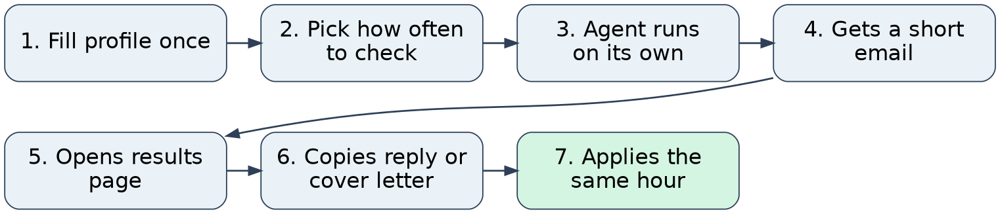
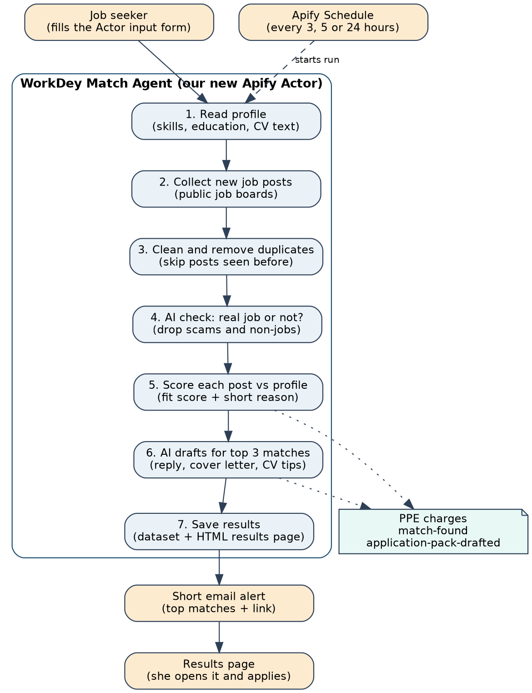

# WorkDey Match Agent

An AI agent, built as an Apify Actor, that watches job boards for a job seeker, picks the jobs that truly fit her profile, and drafts her reply, cover letter and CV tips. It takes her profile (skills, education, experience and CV), checks public Nigerian and remote job boards on a schedule she picks, and scores each new post against her real profile. For the 2 or 3 best fits, it emails her a short alert linking to a results page with a ready reply, a tailored cover letter, and CV update tips — all written using only facts from her own CV.

Built for the [Apify x She Code Africa BuildHer Hackathon 2026](https://apify.com/store) (theme: Ship and Earn Africa, Jobs Board track), from the TypeScript [Crawlee](https://crawlee.dev/) Actor template used in the [workshop example](https://github.com/kazadoiyul/sca2026-demo), then customized.

## How we're different

Other job tools on the Apify Store only collect job posts. WorkDey Match Agent does the hard part: it finds the jobs that actually fit and writes the application.

| | Job scrapers on the Store | WorkDey Match Agent |
| --- | --- | --- |
| Input | Keywords or a search URL | Her full profile and CV |
| Output | A long list of raw posts | 2 or 3 jobs that fit, with reasons |
| Decides what fits | No | Yes, with a score and plain reasons |
| Filters scams and non-jobs | No | Yes |
| Writes the application | No | Reply, cover letter and CV tips |
| Stays honest | Not relevant | Uses only facts from her CV |
| Runs by itself | User must set it up and read results | Schedule plus a short email |
| Built for | General use | African, mainly Nigerian, job seekers |

> "There are job scrapers on Apify already. WorkDey Match Agent is the layer nobody has built: it reads your real profile, finds the 2 or 3 jobs that actually fit, and hands you a ready reply and cover letter, using only facts from your CV."

## How it works

**The job seeker's journey**, from setup to applying:



**The system flow inside the Actor**, run every time it starts:



Every time the Actor runs, it works through seven steps:

1. **Read profile.** Reads the input: skills, education, experience, target roles, location, work type and CV text.
2. **Collect posts.** Scrapes new posts from the selected public job sources into one standard shape (title, company, location, text, link, date, source).
3. **Clean and dedupe.** Removes the same job seen on two sources and skips any job link already sent to this user in an earlier run.
4. **Real job check.** A cheap AI call marks each post as Job, Gig, Not a job or Likely scam. Only Job and Gig move on; posts asking for payment before an interview are dropped.
5. **Score.** Each surviving post gets a fit score from 0 to 100 and 1 or 2 short reasons (e.g. "Matches your Excel and bookkeeping skills; based in Lagos"). A `match-found` event is charged for each post above the minimum score.
6. **Draft.** For the top matches only, the AI writes a reply, a cover letter and CV tips. An `application-pack-drafted` event is charged for each pack.
7. **Deliver.** Results go to the dataset, an HTML results page is saved, and a short email is sent with a link to that page.

To run it every few hours, save the input as an Actor task and add an [Apify Schedule](https://docs.apify.com/platform/schedules) (for example, every 5 hours) — no extra code needed.

## Pricing (Pay Per Event)

We charge for the value the agent creates, not for raw scraping — scraped posts are free, since that's what existing scrapers already sell.

| Event | Suggested price | When it's charged |
| --- | --- | --- |
| `match-found` | $0.02 | Each job that passes the real-job check and scores above `minScore`. |
| `application-pack-drafted` | $0.05 | Each full pack (reply, cover letter, CV tips) written for a top match. |

Example: a run with 5 matches and 3 packs costs the user $0.25. At every 5 hours, that's about $1.20/day — less than a single printed CV. Final prices will be set after measuring real LLM cost. Events are declared in the Actor's monetization settings and charged in code with `Actor.charge()`.

## Quick start

This repo currently holds the basic Actor scaffold — input/output schemas and feature code are still to come.

Install dependencies, then start the Actor:

```bash
npm install

apify run
```

Once your Actor is ready, push it to the Apify Console:

```bash
apify login # first, you need to log in if you haven't already done so

apify push
```

## Project structure

```text
.actor/
└── actor.json # Actor config: name, version, env vars, runtime settings
docs/ # PRD and hackathon program brief
media/ # Diagrams used in this README
src/
└── main.ts # Actor entry point
Dockerfile # Container image definition
```

For more information, see the [Actor definition](https://docs.apify.com/platform/actors/development/actor-definition) documentation.

## Built with

- **[Apify SDK](https://docs.apify.com/sdk/js)** — toolkit for building [Actors](https://apify.com/actors)
- **[Crawlee](https://crawlee.dev/)** — web scraping and browser automation library
- **[Pay Per Event (PPE)](https://docs.apify.com/actors/publishing/monetize/pay-per-event)** — Apify's usage-based monetization method
